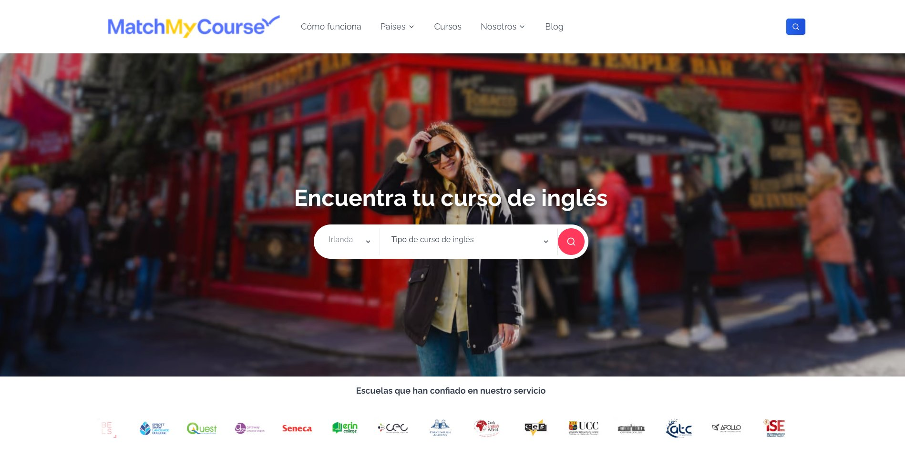
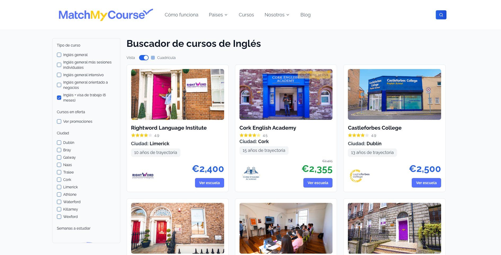
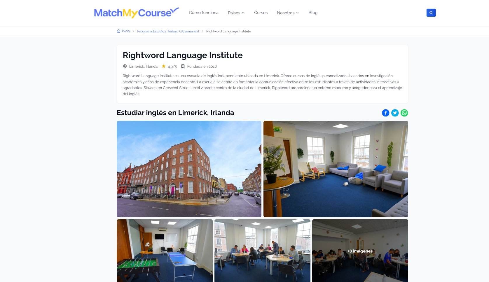
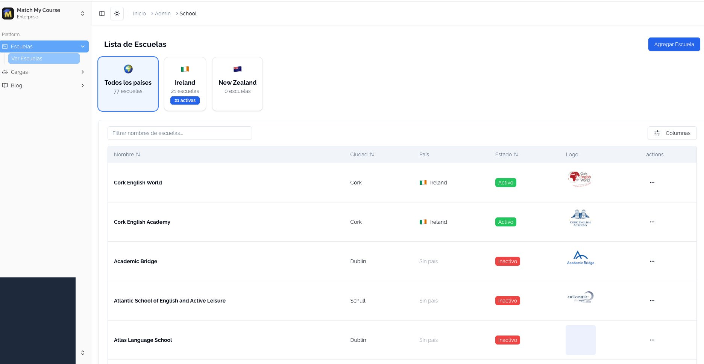

# Match My Course

Ed-tech marketplace connecting international students with English language courses in Ireland and New Zealand.

🔗 **Live:** [matchmycourse.com](https://matchmycourse.com)

## Overview

Built as a solo developer project to help Spanish-speaking students find and compare English language schools abroad. The platform features course search, filtering, school profiles, and an admin panel for content management.

## Results

| Metric | Value |
|--------|-------|
| Active users | 5,000+ |
| Organic traffic growth | 300% |
| Lighthouse performance | 95+ |
| API response optimization | 800ms → 200ms |
| Schools listed | 77 (21 active in Ireland) |
| Countries | Ireland, New Zealand |

## Screenshots

### Homepage

*Landing page with search by country and course type, featuring partner school logos*

### Course Search

*Advanced filtering by course type, city, duration, and price comparison*

### School Detail

*Detailed school profiles with gallery, description, and course information*

### Admin Panel

*School management dashboard with multi-country support and status tracking*

## Tech Stack

### Frontend
- Next.js 15
- React 19
- TypeScript
- Tailwind CSS
- Shadcn UI

### Backend
- Node.js
- Express
- MongoDB
- Redis (caching)

### Infrastructure
- AWS (EC2, S3, CloudFront)
- Vercel (frontend)
- MongoDB Atlas

## Architecture

```
┌─────────────────────────────────────────────────────────────────┐
│                         FRONTEND                                 │
│                    Next.js 15 (SSR/SSG)                         │
└─────────────────────────┬───────────────────────────────────────┘
                          │ REST API
                          ▼
┌─────────────────────────────────────────────────────────────────┐
│                     NODE.JS API                                  │
│  ┌─────────────┐  ┌─────────────┐  ┌─────────────┐              │
│  │   Routes    │  │  Services   │  │ Controllers │              │
│  └─────────────┘  └─────────────┘  └─────────────┘              │
└───────────────────────────┬─────────────────────────────────────┘
                            │
            ┌───────────────┼───────────────┐
            ▼               ▼               ▼
      ┌──────────┐   ┌──────────┐    ┌──────────┐
      │ MongoDB  │   │  Redis   │    │AWS S3    │
      │ (Data)   │   │ (Cache)  │    │(Images)  │
      └──────────┘   └──────────┘    └──────────┘
```

## Key Features

### 🔍 Course Search
- Filter by course type (General, Intensive, Business, Work & Study)
- Filter by city (Dublin, Cork, Galway, Limerick, etc.)
- Price comparison across schools
- Responsive grid/list view toggle

### 🏫 School Profiles
- Detailed school information with founding year
- Photo galleries with multiple images
- Course offerings and pricing
- Location and contact information
- Social sharing (Facebook, Twitter, WhatsApp)

### 🌍 Multi-Country Support
- Ireland (21 active schools)
- New Zealand (expansion ready)
- Easy addition of new countries

### 📊 Admin Panel
- School CRUD operations
- Status management (Active/Inactive)
- Bulk content management
- Blog post editor
- Image upload to S3

### ⚡ Performance Optimizations
- Server-side rendering for SEO (95+ Lighthouse)
- Static generation for school pages
- Image optimization with Next.js Image
- Redis caching for API responses
- CDN delivery via CloudFront

## Technical Highlights

### SEO Optimization (300% traffic growth)
- Dynamic meta tags per school/course
- Structured data (JSON-LD) for schools
- XML sitemap generation
- Server-side rendering for crawlers
- Semantic HTML structure

### API Performance (800ms → 200ms)
- MongoDB query optimization with indexes
- Redis caching layer (5-minute TTL)
- Selective field projection
- Connection pooling

### Image Handling
- Automatic optimization via Next.js
- S3 storage with CloudFront CDN
- Lazy loading for galleries
- WebP format conversion

## Contact

**Marcelo Toro**  
Senior Full Stack Developer

- 📧 mtoro6@gmail.com
- 💼 [LinkedIn](https://linkedin.com/in/marcelo-toro-toro)
- 🌐 [Portfolio](https://marcelo-toro-portfolio.netlify.app/)

---

*This is a live production project. Visit [matchmycourse.com](https://matchmycourse.com) to see it in action.*
